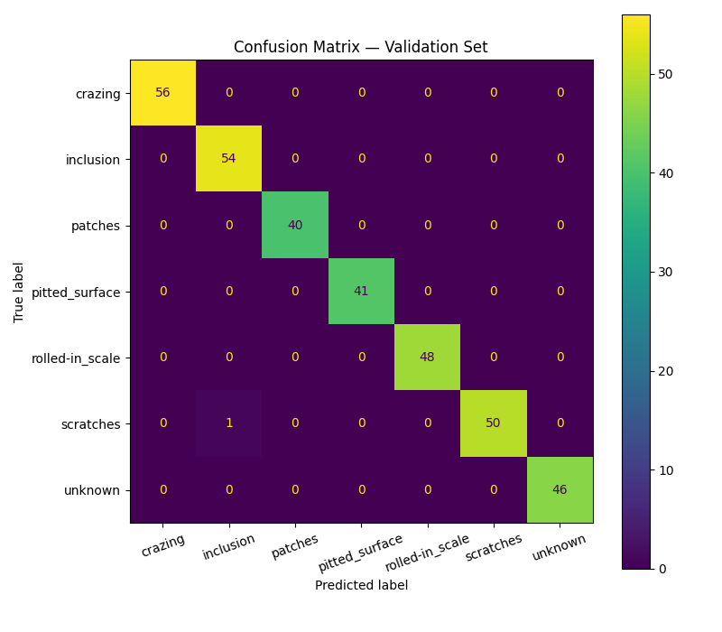
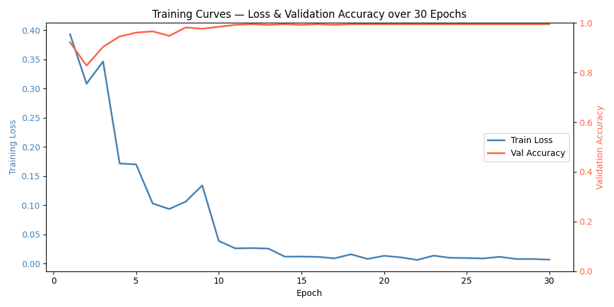

# Industrial Surface Defect Detector

AI-powered visual inspection system for classifying surface defects in aerospace and defense manufacturing components using transfer learning on the NEU Surface Defect Dataset.

---

## Demo

> **[Watch Demo Video](https://youtu.be/cYDXbjDaZHo)**

Live Demo: https://huggingface.co/spaces/trentbolinger/industrial-surface-defect-detector

Live Gradio interface: run `python demo.py` to launch a shareable public URL.

---

## Results

### Classification Performance

| Class | Precision | Recall | F1 Score |
|---|---|---|---|
| Crazing | 1.0000 | 1.0000 | 1.0000 |
| Inclusion | 0.9818 | 1.0000 | 0.9908 |
| Patches | 1.0000 | 1.0000 | 1.0000 |
| Pitted Surface | 1.0000 | 1.0000 | 1.0000 |
| Rolled-in Scale | 1.0000 | 1.0000 | 1.0000 |
| Scratches | 1.0000 | 0.9804 | 0.9901 |
| Unknown | 1.0000 | 1.0000 | 1.0000 |
| **Overall Accuracy** | | | **99.70%** |

### Confusion Matrix



---

## Training Curves



*30 epochs — training loss (blue) and validation accuracy (red) with StepLR decay at epochs 10 and 20.*

---

## Dataset

**[NEU Surface Defect Dataset](http://faculty.neu.edu.cn/yunhyan/NEU_surface_defect_database.html)** — a benchmark dataset for automatic detection of surface defects on hot-rolled steel strips, collected by Northeastern University (NEU).

- **1,800 grayscale images** across 6 defect classes (300 per class)
- **240 additional images** downloaded from [picsum.photos](https://picsum.photos) as an `unknown` rejection class
- **Split:** 80% train / 20% validation, stratified by class
- **Resolution:** 200×200 px (resized to 224×224 for training)

| Class | Description |
|---|---|
| Crazing | Network of fine surface cracks |
| Inclusion | Embedded foreign particles |
| Patches | Irregular surface discoloration |
| Pitted Surface | Small pits or holes across the surface |
| Rolled-in Scale | Oxide scale pressed into the surface |
| Scratches | Linear surface marks |
| Unknown | Non-steel images — triggers rejection in the demo |

---

## Model Architecture & Approach

- **Base model:** ResNet-18 pretrained on ImageNet (torchvision)
- **Fine-tuning:** Final fully-connected layer replaced with a 7-class head; all layers trained end-to-end
- **Input pipeline:** Grayscale → 3-channel RGB → resize 224×224 → normalize with ImageNet mean/std
- **Loss:** Cross-entropy
- **Optimizer:** Adam (lr = 0.001)
- **LR schedule:** StepLR — ×0.1 decay every 10 epochs
- **Epochs:** 30
- **Batch size:** 32
- **Hardware:** NVIDIA DGX Spark

The model returns "Unknown / Not a valid steel surface" when maximum class confidence falls below 85%, preventing overconfident predictions on out-of-distribution inputs.

---

## How to Run

**1. Install dependencies**
```bash
pip install torch torchvision pillow matplotlib scikit-learn gradio requests
```

**2. Explore the dataset**
```bash
python explore_data.py      # class distribution bar chart
python view_samples.py      # 2×3 sample grid
```

**3. Train**
```bash
python train.py             # trains for 30 epochs, saves outputs/best_model.pth
```

**4. Evaluate**
```bash
python evaluate.py          # confusion matrix + per-class metrics
```

**5. Plot training curves**
```bash
python plot_training.py     # saves outputs/training_curves.png
```

**6. Launch demo**
```bash
python demo.py              # Gradio interface with public share URL
```

---

## Tech Stack

| Tool | Purpose |
|---|---|
| Python 3.11 | Core language |
| PyTorch + torchvision | Model training and inference |
| Pillow | Image loading and preprocessing |
| scikit-learn | Evaluation metrics and confusion matrix |
| Matplotlib | Charts and visualizations |
| Gradio | Interactive web demo |
| NVIDIA DGX Spark | GPU training |

---
